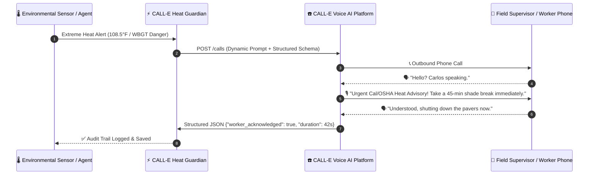

# ☎️ CALL-E Heat Guardian — Autonomous Emergency Voice Dispatcher

[](https://heycall-e.com)
[](LICENSE)
[](https://python.org)
[](https://fastapi.tiangolo.com)
[](https://call-e.devpost.com)

> **Turn code into an autonomous AI agent that places real emergency phone calls to protect outdoor industrial, construction, and agricultural workforces from lethal heat strain.**

Built for the **Devpost Global Hackathon — CALL-E: Your Code Is Calling**.

---

## 🌟 The Problem & The Solution

### The Challenge
Over **2.4 billion outdoor workers** worldwide labor under hazardous thermal conditions. Traditional automated alerts (SMS, push notifications, emails) are frequently **missed or ignored** by field crews wearing heavy personal protective equipment (PPE), operating noisy machinery, or working under direct sunlight.

### The CALL-E Solution
**CALL-E Heat Guardian** closes this life-critical gap. Instead of stopping at a text message or dashboard notification, it empowers AI systems to **pick up the phone, dial out directly to the field supervisor, hold a fluent conversational emergency advisory in English, enforce OSHA-mandated work/rest cycles and hydration quotas, and return a structured acknowledgment record.**



---

## 📂 Repository Structure

This repository is designed both as a standalone production service and as a reusable contribution to [`CALLE-AI/awesome-phone-call-agents`](https://github.com/CALLE-AI/awesome-phone-call-agents):

```
calle-heat-safety-agent/
├── skills/
│   └── heat_safety_dispatcher/       # Reusable Agent Skill (Codex, Claude Code, ChatGPT, MCP)
│       ├── SKILL.md                  # Human & Agent readable skill documentation
│       ├── skill.json                # Machine-readable parameter & schema definitions
│       ├── dispatcher.py             # Standalone Python async dispatcher module
│       └── __init__.py
├── apps/
│   └── python/
│       └── calle-heat-guardian/      # Standalone CLI & Web Application
│           ├── main.py               # Interactive CLI single-command dialer
│           ├── server.py             # FastAPI webhook & REST server
│           ├── config.py             # Pydantic environment configuration
│           └── requirements.txt      # Lightweight dependencies
├── tests/
│   └── test_calle_integration.py     # Automated test suite (E.164, Schemas, API verification)
├── docs/
│   ├── DEVPOST_SUBMISSION.md         # Devpost submission write-up
│   └── PR_TEMPLATE.md                # Community Pull Request template
├── requirements.txt
└── README.md
```

---

## 🚀 Quickstart Guide

### 1. Installation
```bash
git clone https://github.com/HamzaNasiem/calle-heat-safety-agent.git
cd calle-heat-safety-agent
pip install -r requirements.txt
```

### 2. Configure Environment
Copy `.env.example` to `.env`:
```bash
cp .env.example .env
```
Add your CALL-E API key:
```env
CALLE_API_KEY=your_calle_api_key_here
CALLE_BASE_URL=https://api.heycall-e.com/v1
```

### 3. Run Single-Command Interactive Test Call (CLI)
Place a real test dispatch to your phone in seconds:
```bash
python apps/python/calle-heat-guardian/main.py --phone "+12135550192" --worker "Carlos Rodriguez" --temp 109.5 --site "Downtown LA Logistics Hub"
```

### 4. Launch FastAPI Server
```bash
python apps/python/calle-heat-guardian/server.py
```
Open your browser at `http://localhost:8000/docs` to interact with Swagger documentation.

---

## 🧩 Using as an AI Agent Skill (ChatGPT, Claude Code, Codex, MCP)

You can invoke this skill directly inside any agent workflow:

```python
import asyncio
from skills.heat_safety_dispatcher import HeatSafetyPayload, trigger_heat_call

async def main():
    payload = HeatSafetyPayload(
        phone_number="+12135550192",
        worker_name="Carlos Rodriguez",
        site_name="Port of Long Beach Freight Terminal",
        temperature_f=107.5,
        work_rest_ratio="15 min work / 45 min rest",
        hydration_liters_per_hour=1.5,
        cooling_refuge_direction="North-East Shaded Canopy (Sector B)"
    )
    result = await trigger_heat_call(payload)
    print(f"Call Task ID: {result.call_id} | Status: {result.status}")

asyncio.run(main())
```

---

## 🧪 Automated Testing

Run the automated test suite:
```bash
python -m pytest tests/ -v
```

---

## 📜 License
MIT License. Free for open source and commercial use.
